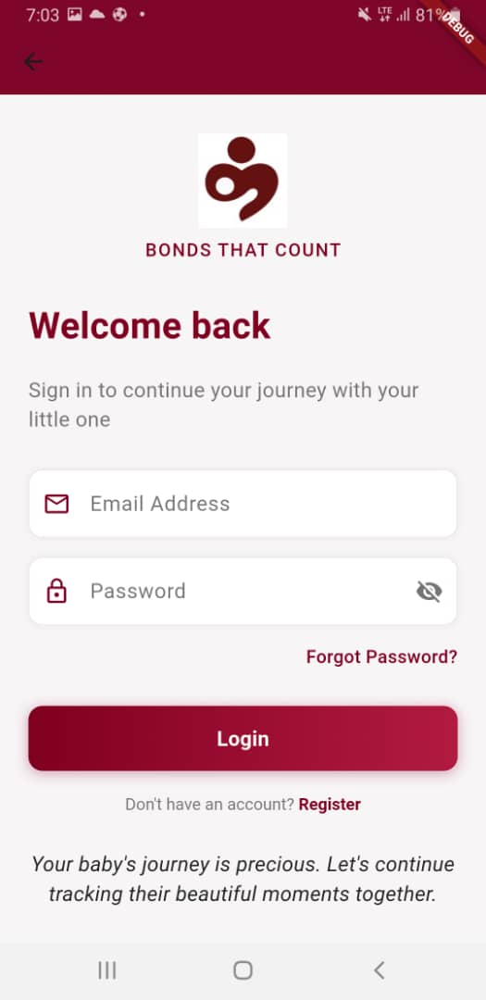

<a id="readme-top"></a>

<div align="center">
  
  
  # BuriCare Mobile App
  
  ### Real-time monitoring and care for premature babies
  
  [![Contributors][contributors-shield]][contributors-url]
  [![Forks][forks-shield]][forks-url]
  [![Stars][stars-shield]][stars-url]
  [![Issues][issues-shield]][issues-url]
  [![License][license-shield]][license-url]
  [![LinkedIn][linkedin-shield]][linkedin-url]

  [](assets/demo.mp4)
  [](https://github.com/thefr3spirit/buricare_mobile_app)
  [](https://github.com/thefr3spirit/buricare_mobile_app/issues/new?labels=bug)
</div>

---

## 📋 Table of Contents

- [📱 About BuriCare](#about-buricare)
- [✨ Key Features](#key-features)
- [🛠️ Built With](#built-with)
- [🚀 Getting Started](#getting-started)
  - [Prerequisites](#prerequisites)
  - [Installation](#installation)
- [💻 Usage](#usage)
- [📊 Screenshots](#screenshots)
- [🗺️ Roadmap](#roadmap)
- [👥 Contributing](#contributing)
- [📄 License](#license)
- [📞 Contact](#contact)

---

## About BuriCare

<div align="center">
  
</div>

BuriCare is a cutting-edge Flutter application designed to work with a specialized Bluetooth-connected pouch device, creating an optimal environment for premature babies. The system combines hardware innovation with software excellence to provide comprehensive monitoring and care solutions.

The pouch device features advanced sensors that continuously track vital signs including heart rate, temperature, and oxygen saturation (SpO₂). This data streams directly to the mobile app in real-time, allowing both medical professionals and parents to monitor the baby's condition from anywhere.

## Key Features

- **📊 Real-time Vitals Dashboard** - View critical measurements on dedicated, easy-to-read tiles
- **💾 Offline Reliability** - Local storage using Hive ensures data is never lost
- **📈 Smart Data Aggregation** - Automatic calculation of minute, hourly, and daily averages
- **☁️ Cloud Synchronization** - Seamless syncing with Firebase Firestore when connected
- **🚨 Intelligent Alerts** - Immediate notifications when vitals fall outside safe ranges
- **🔄 Background Operation** - Continuous monitoring even when the app is closed
- **👨‍👩‍👧‍👦 Family Sharing** - Multiple caregivers can access the same baby's data

<p align="right">(<a href="#readme-top">back to top</a>)</p>

---

## Built With

<div align="center">
  
  [![Flutter][Flutter-shield]][Flutter-url] 
  [![Dart][Dart-shield]][Dart-url] 
  [![Firebase][Firebase-shield]][Firebase-url]
  
  [![Hive][Hive-shield]][Hive-url] 
  [![Riverpod][Riverpod-shield]][Riverpod-url] 
  [![Connectivity Plus][Connectivity-shield]][Connectivity-url]
  
</div>

<p align="right">(<a href="#readme-top">back to top</a>)</p>

---

## Getting Started

### Prerequisites

Before you begin, ensure you have the following installed:

- Flutter SDK (>= 3.19)
- Dart SDK (>= 3.3)
- Android Studio / Xcode
- Firebase project with Android/iOS apps configured

### Installation

1. **Clone the repository**
   ```sh
   git clone https://github.com/thefr3spirit/buricare_mobile_app.git
   cd buricare_mobile_app
   ```

2. **Install dependencies**
   ```sh
   flutter pub get
   ```

3. **Configure Firebase**
   - Place `google-services.json` in `android/app/`
   - Place `GoogleService-Info.plist` in `ios/Runner/`
   - Generate configuration files:
     ```sh
     flutterfire configure
     ```

4. **Generate Hive adapters**
   ```sh
   flutter pub run build_runner build --delete-conflicting-outputs
   ```

5. **Run the application**
   ```sh
   flutter run
   ```

<p align="right">(<a href="#readme-top">back to top</a>)</p>

---

## Usage

<div align="center">
  <table>
    <tr>
      <td align="center">
        <br>
        <b>Authentication</b>
      </td>
      <td align="center">
        <br>
        <b>Vitals Dashboard</b>
      </td>
      <td align="center">
        <br>
        <b>Historical Data</b>
      </td>
    </tr>
  </table>
</div>

### Authentication

The app features a streamlined authentication flow:
- Sign in with email/password or Google account
- Automatic routing to sign-in, email-verification, or home screens

### Home Dashboard

The heart of BuriCare is the intuitive dashboard:
- Real-time visualization tiles for each vital sign
- Color-coded indicators for at-a-glance status assessment
- Easy access to historical data through interactive graphs

### Background Operation

BuriCare continues monitoring even when not in active use:
- On Android, a foreground service maintains connectivity
- On iOS, background fetch enables periodic data synchronization
- Low battery impact through optimized Bluetooth communication

<p align="right">(<a href="#readme-top">back to top</a>)</p>

---

## Screenshots

<div align="center">
  
</div>

<p align="right">(<a href="#readme-top">back to top</a>)</p>

---

## Roadmap

Our development roadmap focuses on enhancing functionality and user experience:

- [ ] Advanced analytics dashboard with trend detection
- [ ] Push notifications for alerts when app is closed
- [ ] Enhanced background reliability for iOS devices
- [ ] Comprehensive unit and integration test suite
- [ ] Automated CI/CD pipeline for builds and testing
- [ ] Medical professional portal with expanded capabilities

See our [open issues](https://github.com/thefr3spirit/buricare_mobile_app/issues) for a complete list of proposed features and known issues.

<p align="right">(<a href="#readme-top">back to top</a>)</p>

---

## Contributing

We welcome contributions to the BuriCare project! Here's how to get involved:

1. Fork the repository
2. Create your feature branch: `git checkout -b feature/AmazingFeature`
3. Commit your changes: `git commit -m 'Add some AmazingFeature'`
4. Push to your branch: `git push origin feature/AmazingFeature`
5. Open a Pull Request

Please read our [Contributing Guidelines](CONTRIBUTING.md) for more information.

<p align="right">(<a href="#readme-top">back to top</a>)</p>

---

## License

Distributed under the MIT License. See [`LICENSE`](LICENSE) for more information.

<p align="right">(<a href="#readme-top">back to top</a>)</p>

---

## Contact

Beofr3Spirit – [@thefr3spirit](https://github.com/thefr3spirit) – beofr3spirit@gmail.com

Project Link: [https://github.com/thefr3spirit/buricare_mobile_app](https://github.com/thefr3spirit/buricare_mobile_app)

<p align="right">(<a href="#readme-top">back to top</a>)</p>

---

<!-- MARKDOWN LINKS & IMAGES -->
[contributors-shield]: https://img.shields.io/github/contributors/thefr3spirit/buricare_mobile_app.svg?style=for-the-badge
[contributors-url]: https://github.com/thefr3spirit/buricare_mobile_app/graphs/contributors
[forks-shield]: https://img.shields.io/github/forks/thefr3spirit/buricare_mobile_app.svg?style=for-the-badge
[forks-url]: https://github.com/thefr3spirit/buricare_mobile_app/network/members
[stars-shield]: https://img.shields.io/github/stars/thefr3spirit/buricare_mobile_app.svg?style=for-the-badge
[stars-url]: https://github.com/thefr3spirit/buricare_mobile_app/stargazers
[issues-shield]: https://img.shields.io/github/issues/thefr3spirit/buricare_mobile_app.svg?style=for-the-badge
[issues-url]: https://github.com/thefr3spirit/buricare_mobile_app/issues
[license-shield]: https://img.shields.io/github/license/thefr3spirit/buricare_mobile_app.svg?style=for-the-badge
[license-url]: https://github.com/thefr3spirit/buricare_mobile_app/blob/master/LICENSE
[linkedin-shield]: https://img.shields.io/badge/-LinkedIn-black.svg?style=for-the-badge&logo=linkedin&colorB=555
[linkedin-url]: https://linkedin.com/in/thefr3spirit

[Flutter-shield]: https://img.shields.io/badge/Flutter-02569B?style=for-the-badge&logo=flutter&logoColor=white
[Flutter-url]: https://flutter.dev/
[Dart-shield]: https://img.shields.io/badge/Dart-0175C2?style=for-the-badge&logo=dart&logoColor=white
[Dart-url]: https://dart.dev/
[Firebase-shield]: https://img.shields.io/badge/Firebase-FFCA28?style=for-the-badge&logo=firebase&logoColor=black
[Firebase-url]: https://firebase.google.com/
[Hive-shield]: https://img.shields.io/badge/Hive-FF9E0F?style=for-the-badge&logo=hive&logoColor=white
[Hive-url]: https://pub.dev/packages/hive_flutter
[Riverpod-shield]: https://img.shields.io/badge/Riverpod-0175C2?style=for-the-badge&logo=dart&logoColor=white
[Riverpod-url]: https://pub.dev/packages/flutter_riverpod
[Connectivity-shield]: https://img.shields.io/badge/Connectivity-4285F4?style=for-the-badge&logo=google&logoColor=white
[Connectivity-url]: https://pub.dev/packages/connectivity_plus
